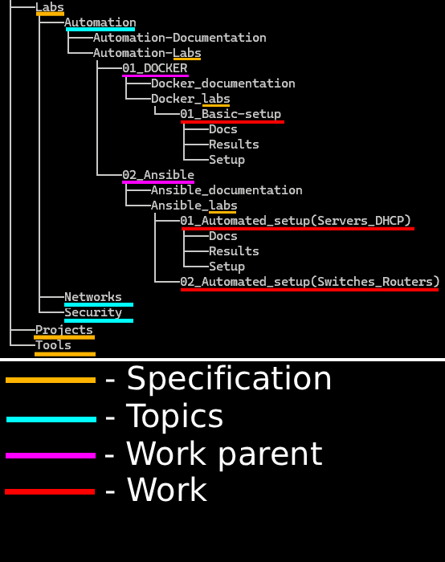

# Welcome to my personal technical research !
*Detailed hands-on personal labs , projects , documentations and tools*

 
 

> ***"Simple , yet complex"***

 

Here I'm sharpening my skills in fileds like:
- **Infrastructure**
- **Devops**
- **Security**

Always trying to use or develop the best practices of how work should be done. 
Aiming for knowledge depth and integration between fields. 

**Everyone is welcome here !** 
I'm sure someone will find something useful here , especially rookies. 
**However , because I'm learning myself , make sure to check important information before you use anything from available materials.**

## Repository structure
Structure version: **v3**  
### **Main structure of repository:**  

### Design pick
Repository is divided by **specification , topic , work parent and work** - such structure allows to add different sorts of work without breaking the structure and keeping it easy to understand and follow when repository grows big.  

### Specifications
Repository has 3 specifications:

- **Labs** - learning about specific topics and tools , also trying that knowledge practically at small scales to build skills.
- **Projects** -  serious structures or products that combine knowledge and skills.
- **Tools** - useful custom tools that are being often used to get the job done.

### Work
**"Work"(red line)** are mostly build by structure:

- **Docs** - tells everything about the project like how it works , why it works , all connection schemes , operating systems used , tools used , summary of mistakes/troubles , possible mistakes , etc.
- **Results** - showes short demo of project working.
- **Setup** - detailed or important-only steps taken to make the project work.
- **Recreate** - some projects may include auto-setup files (usually ansible playbooks) to allow quickly recreate working project and instructions on how to use them properly.
- **README** - tells about the project , it's purpose and it's structure briefly.

**However** - some projects may vary slightly in structure and logic so it is recommended to read "README" first.

### Exceptions
All **"Specifications"(orange line)** follow the same structure as shown on the image above , however documentations under **"Topic"(cyan line)** and **"Work parent"(pink line)** might NOT appear - they mostly exist in "Labs" specification.